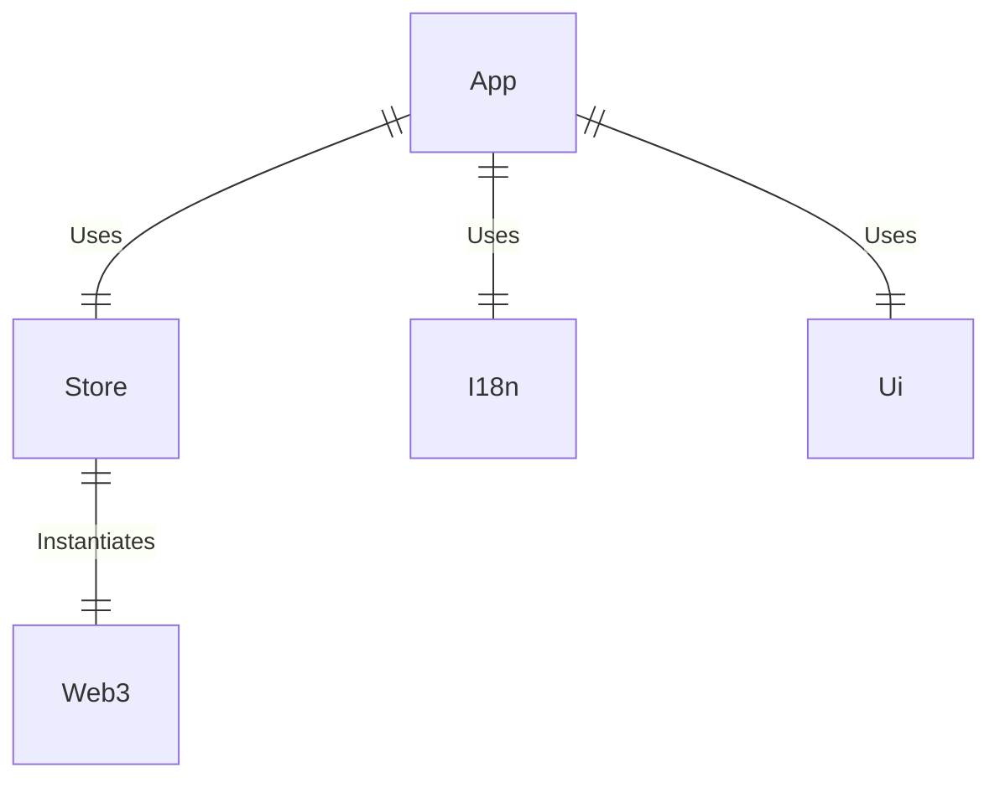
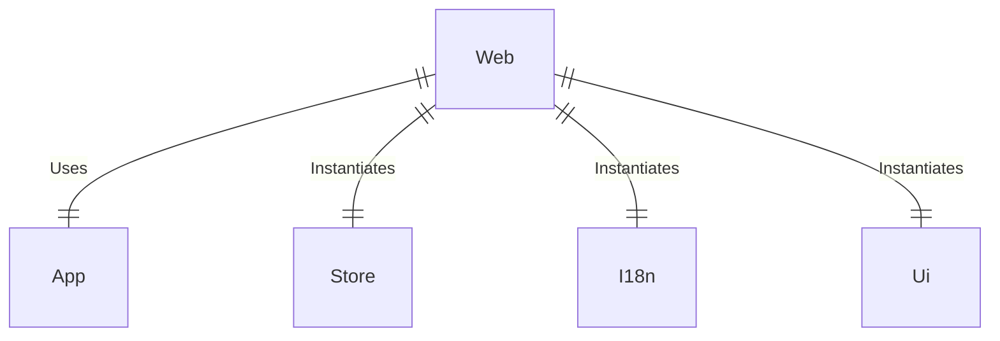
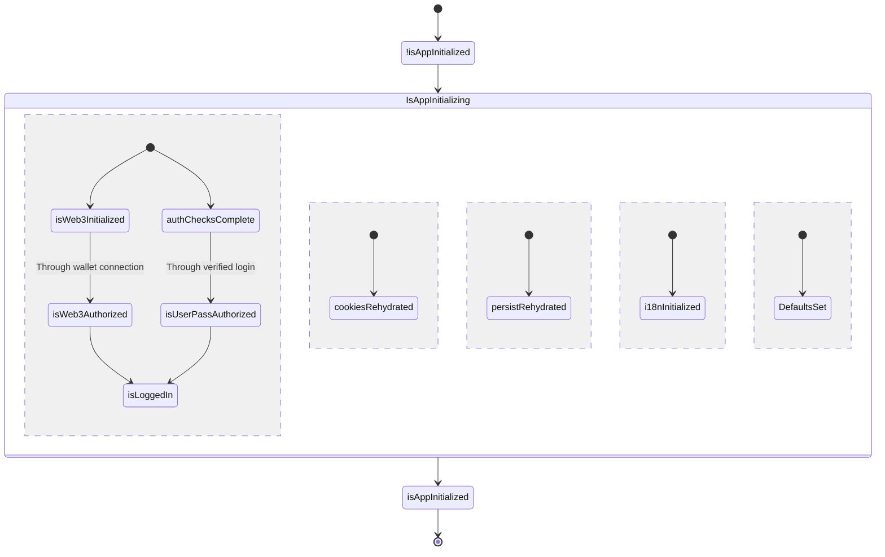

# Nextjs Grpc Frontend Monorepo

Android and Web App for the Nextjs Grpc project.

## Monorepo structure

### Inter-package relationships

Unlisted packages such as `eslint-config-custom` and `tsconfig` are support packages.

### App - Package relationships

This chart only shows the relationships of Web app to keep the chart concise. The same graph holds exactly for any other app that is managed by this repo.

## App States

State transitions tracked in `app` slice of the store. Most of these transitions are performed by `initializationMiddleware` defined in `store`.

Most of the state names given above are boolean values inside `app` slice. Most of these state transitions are governed by `initializationMiddleware`, which resides in path `packages/store/middlewares`. 
The middleware only alters values under `app._computed` in store. Please refer to modules [`app.slice`](/packages/store/src/slices/app.slice.ts) and [`initialization.middleware`](/packages/store/src/middlewares/initialization.middleware.ts) for details.
